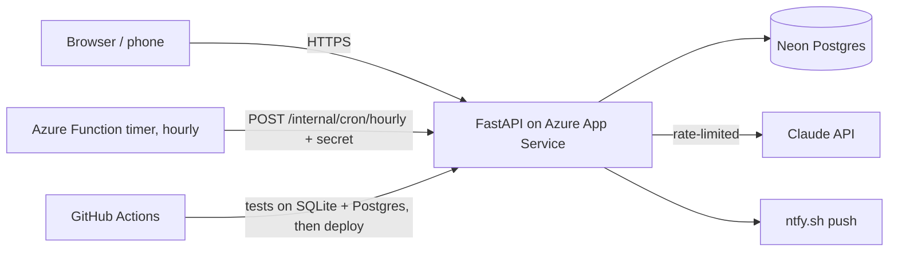

# AI Execution Planner

**Live demo:** https://YOUR-APP.azurewebsites.net &nbsp;·&nbsp; click **Try the demo**, no signup needed

Most to-do apps let you pile 14 tasks onto a 6-hour day. This planner does something different. It
turns goals into tasks (optionally using Claude), works out how much free time you actually have
around your calendar, and builds a realistic, energy-aware schedule. When you skip something, it
replans on its own.


## Features

- **AI goal decomposition.** "Learn GenAI in 3 months" becomes 8–15 scheduled tasks with effort,
  priority and energy estimates (Claude API). Calls are metered per user per day and globally, and
  it falls back to a template when a limit is hit or the API fails.
- **Calendar-aware capacity.** Your busy blocks are subtracted from the day, and time that has
  already passed today is excluded.
- **Energy-aware greedy scheduler.** High-focus work goes in the morning and low-energy work in the
  evening, sorted by urgency (priority, deadline proximity, how often a task was postponed). Large
  tasks are split across free slots, and dependencies are respected.
- **Automatic replanning.** Skipping a task bumps its urgency and regenerates today's and
  tomorrow's plans.
- **Learns your estimates.** An exponential moving average of actual vs. estimated time scales future plans.
- **Goal risk detection.** Flags goals that would need more than 3 h/day to hit their deadline.
- **Push notifications** to phone and laptop via ntfy: a morning plan and evening risk alerts, sent
  at the right time in *each user's own timezone*.
- **Multi-user.** Email/password accounts (bcrypt, signed httpOnly session cookie), strict per-user
  data isolation, one-click guest sandboxes that are deleted after 24 h, and account deletion.

## Architecture



| Module | Responsibility |
|---|---|
| `app/planner.py` | Scheduling engine: capacity, energy windows, urgency scoring, task splitting, replanning, risk |
| `app/ai_decompose.py` | Claude prompt, output validation/sanitising, per-user and global daily metering, fallback |
| `app/auth.py` | Signup/login/demo, bcrypt, session cookie, IP rate limiting, timezone helpers |
| `app/jobs.py` | Idempotent hourly job: per-timezone morning plan and risk alerts, guest cleanup |
| `app/main.py` | REST API (OpenAPI docs at `/docs`), ownership checks, quotas, security headers |
| `azure_function/` | Timer trigger that wakes the (free-tier, sleeping) web app every hour |

**Design decisions**

- **External timer instead of an in-process scheduler.** Free-tier web apps sleep, and multiple
  workers would duplicate jobs. A single hourly tick plus `last_*_run` dates makes the jobs
  idempotent and timezone-correct.
- **AI cost control.** Usage is reserved before the API call so parallel requests can't exceed the
  cap, and it's refunded if the call fails. The model's output is treated as untrusted and
  clamped/validated.
- **Security.** Every row lookup is scoped to the session user (404 rather than 403, so other
  users' IDs are never confirmed). Output in the dashboard is HTML-escaped. There are SameSite
  cookies, login/signup rate limits, and per-user row quotas so a free database can't be filled up.

## Run locally

```bash
python -m venv .venv && source .venv/bin/activate    # Windows: .venv\Scripts\activate
pip install -r requirements-dev.txt
cp .env.example .env        # optional: add ANTHROPIC_API_KEY
uvicorn app.main:app --reload
```

Open http://localhost:8000. Data goes into a local `planner.db` SQLite file. Locally, the hourly
job runs inside the app, so there's nothing else to set up.

With Docker instead: `docker build -t planner . && docker run -p 8000:8000 planner`

## Tests

```bash
pytest -q                                              # SQLite
TEST_DATABASE_URL=postgresql://user:pw@localhost/test pytest -q   # Postgres
```

20 tests cover auth, cross-user isolation, AI limits and fallback, the scheduler, input validation,
cron auth and idempotency. CI runs them against both SQLite and Postgres on every push.

## Deploy

See **[docs/DEPLOY_AZURE.md](docs/DEPLOY_AZURE.md)**: App Service (free tier) + Neon Postgres +
an Azure Functions timer, with GitHub Actions deploying on every push to `main`.

## Notifications (ntfy)

1. Pick a hard-to-guess topic, e.g. `anu-planner-9f21ac`. Anyone who knows it can read your pushes.
2. Phone: install the **ntfy** app and subscribe to the topic. Laptop: open `https://ntfy.sh/<topic>`
   and enable notifications.
3. Enter the topic in the dashboard's *Notifications* box. A test push arrives immediately.

## Roadmap

- Google/Outlook calendar sync (OAuth) in place of manual busy blocks
- Alembic migrations (the schema is currently created with `create_all`)
- Weekly review agent, and a planner → evaluator → replan loop with an LLM critic
- Focus-mode timer, drag-to-reschedule UI
